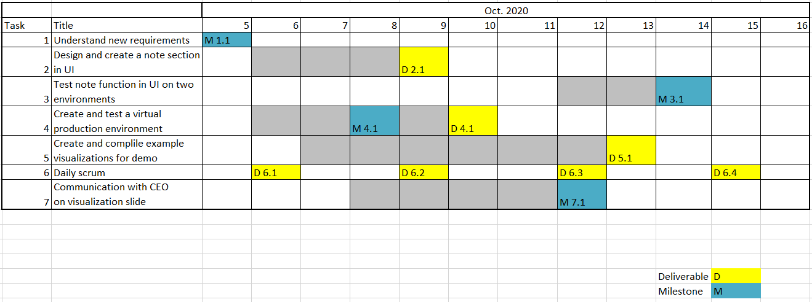

## Welcome to MyWonder
This is an overveiw of our project.

### Project Summary

MyWonder is a platform over which users can conduct big data analytics and visualize the results. Conventionally, files for big data are very large in size, so storing the files requires hardware with a huge amount of memory and PCs may not have enough memory space for them. Besides that, processing those files for big data analytics and visualization needs very high computing power, which is sometimes not feasible on personal devices or the execution time may be too long. Thanks to MyWonder, which uses a distributed file system to store users’ files on the cloud, users can easily manage their big data files by using the platform. MyWonder uses advanced cloud computing architecture for big data analytics and visualizations so that users can access to the platform with mobile devices and obtain the results fast. Before the advent of MyWonder, uses usually experience difficulties in storing big data files, analyzing the data, and visualizing the results. This hinders a number of applications based on big data. MyWonder allows users to interact with their big data files with ease and analyze the data in a short time through devices including mobile ones. This improves the users’ work efficiency as they can acquire the results they want quickly and conveniently. The same amount of work for creating visualizations from massive files, which should take hours to complete, can be reduced under 10 min. Hence, MyWonder makes the users confident as they can calculate their analytics and summaries with their phones even before jumping to a meeting. As a result, the users can manage their work very well through MyWonder.

### Identified Wastes
- The first waste is that the confusion on terminology and contents in the user interface make the CEO calls the customer assistance team constantly. This wastes the both CEO’s time and the resources that assistance team has to use to address the issues.

- The second waste is the communication cost that the customer support does not know the work division for the project very well so that different teams need to ask each other to figure out who can update the contents in the user interface.

- The third waste is that it is not necessary for everyone in team to create the visualization examples since some people may not have the skills to create quality visualizations. Also, if the team is big, they will end up with too many visualization examples.

### Deliverables
- Release of UI with "note" section added.
- Release of the new production environment
- Powerpoint with visualization examples.
- SCRUM deliverables including product vision statement, product roadmap, and etc.

### Milestone
- Successfully test the new "note" section on UI.

### Gantt Chart

